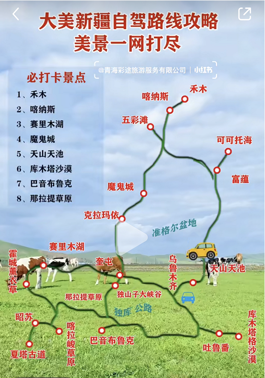

<!--
 * @Author: 吴迪
 * @Date: 2021-09-07 21:18:59
 * @LastEditors: OBKoro1
 * @LastEditTime: 2021-09-12 16:46:16
-->
<!--
 * @Author: 吴迪
 * @Date: 2021-09-07 21:18:59
 * @LastEditors: OBKoro1
 * @LastEditTime: 2021-09-12 14:40:48
-->
# Introduction https://jugetaozi.github.io/xinjiang-plan/
# [在线地址](https://jugetaozi.github.io/xinjiang-plan/)

可可托海-乌伦古湖-布尔津-禾木-贾登峪-喀纳斯-白哈巴-世界魔鬼城

9-17 D0:乌鲁木齐集合

9-18 D1:乌鲁木齐-可可托海镇 8h, 600km

9-19 D2:可可托海镇-乌伦古湖--布尔津--（看情况去不去五彩滩）

9-20 D3:布尔津--禾木 

9-21 D4:禾木-贾登峪-喀纳斯-贾登峪

9-22 D5:贾登峪-喀纳斯-白哈巴-贾登峪

9-23 D6:

9-24 D7:

9-25 D8:

9-26 D9:

▶穿衣提示：9-10月的北疆昼夜温差很大，清晨零度以下，太阳升起后可达到20℃左右，所以要多带点衣服，保暖内衣、抓绒衣、手套、保暖徒步鞋等等都要带上。

▶必备物品：感冒药、止疼药、肠胃药等等最好做好准备以防万一。身份证、驾驶证、边境证、车辆保险一定要带上！

▶住宿：最好带上睡袋，喀纳斯、禾木、白哈巴、五彩城的住宿条件比较差，而且晚上也很冷。

▶消费水平：北疆旅游的预算并不低，如果想全面、舒适地游玩8-10天，预算最好在7000-8000左右。

▶租车：我们租车是捷达VS7  日均150  10天   1500左右

▶租车时一定要依次核实：行驶证、保险（全险）是否齐全、点烟器是否好使（接GPS、充电等）、备胎、随车工具、刹车片和油、各种灯光、雨刷、四轮的纹路和气压、外观刮痕、前后左右梁是否有脱落迹象、是否跑偏、车内感受一下各地方是否有异响，特别是发动机前部，最好全都写在租车合同中，以免起纠纷时无法追究责任。