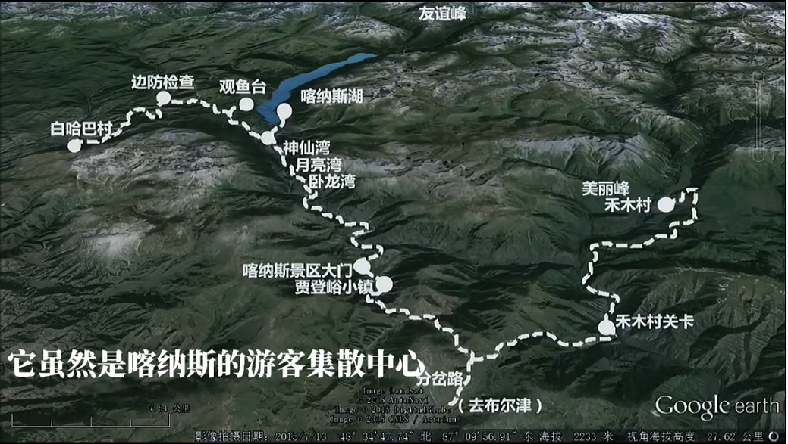

# D4:禾木-贾登峪-喀纳斯-贾登峪

喀纳斯景区包括3部分：1、喀纳斯湖景区（含喀纳斯湖、观鱼台、神仙湾、月亮湾、卧龙湾）2、禾木村 3、白哈巴村；

如果都去通票是375元钱（景区窗口购买）
禾木村和白哈巴都是独立景区，都可以从景区外进入。白哈巴村需要边防证，在换乘中心凭身份证免费办理。

换乘中心有三条区间车路线：1号线：喀纳斯湖（漂流、民宿）2号线：沿途神仙湾、月亮湾、卧龙湾往返3号线：观鱼台、白哈巴村。

建议先去3号线，看喀纳斯湖全貌 再回到换乘中心坐2号线看三湾